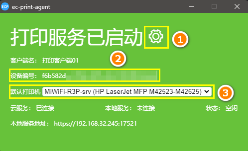
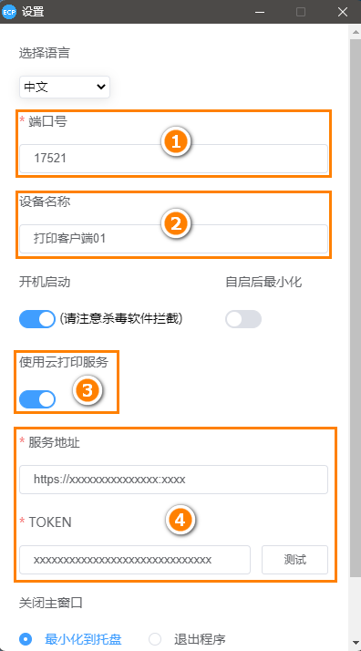
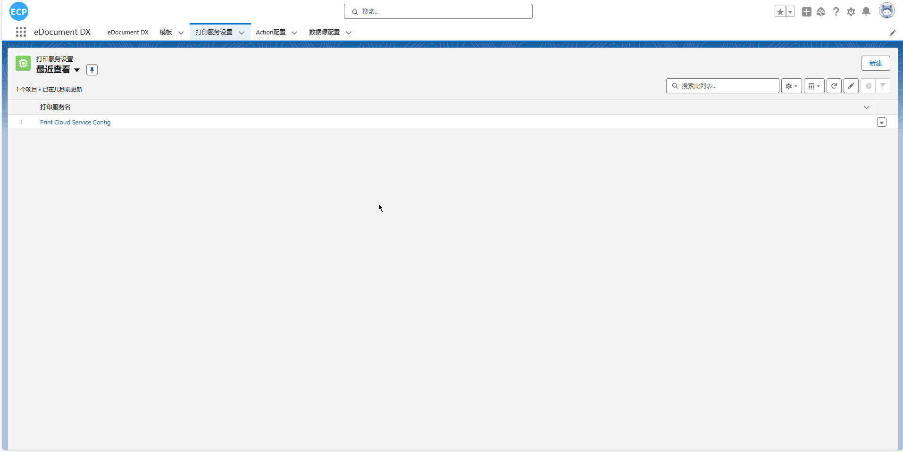
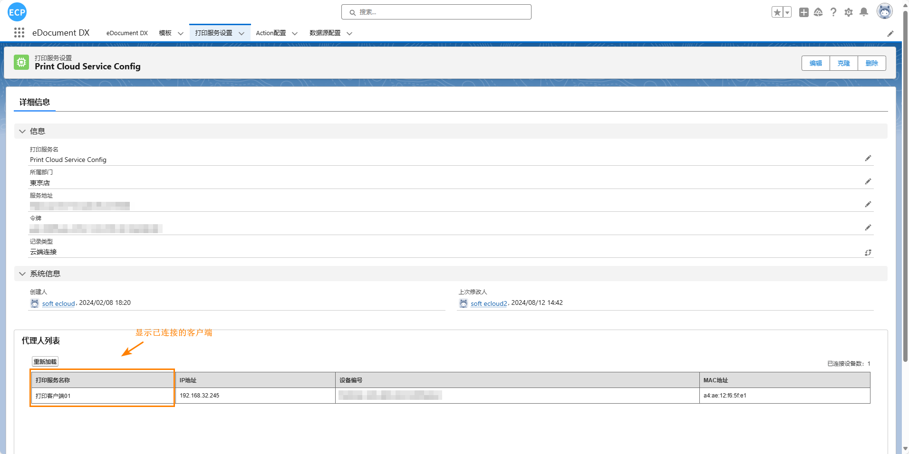

<h5 id="start"></h5>

### 云打印服务

<aside>
💡 云打印技术通过互联网连接打印设备，支持远程打印。完成设计后，可直接发送到远程打印机，无视地域限制。云打印提高了效率和灵活性，简单配置后即可随时随地打印。更换设备或场所时，轻松修改配置即可无缝切换。云打印技术为打印带来极大便利和高效。
</aside>
<br>

#### **1. 初始设置：配置打印中继应用（已配置请跳过）**

**1.1 下载与启动：**请访问[打印终端](download.md)下载打印中继应用程序。

**1.2 设置连接参数：**在启动后，您需要按照指引设置打印中继应用程序的连接参数。
> 请发邮件到info@e-cloudsoft.com，获取测试用服务器令牌。

```
服务器地址：
    https://xxxxxxxxxxxxxxx:xxxx
服务器令牌(购买后提供)：
    xxxxxxxxxxxxxxxxxxxxxxxxxxxxxx
```

① 设定功能  
② 当前机器的设备编号  
③ 选择要打印的打印机

</img>

① 打印服务的端口号，可以任意设定。  
② 当前打印服务设备的名称，可以任意设定。  
③ 云打印开关，关闭为本地打印，开启为云打印。  
④ 云打印配置，填入云打印地址和TOKEN后即可通过云端打印。

</img>

#### **2. 云打印服务配置**

**2.1 进入打印设置界面：**点击"打印服务设置"标签，您将进入打印服务的配置界面。


**2.2 新建或编辑打印服务：**在此界面，您可以新建云打印服务或编辑既存的配置。



**2.3 查看已连接打印设备：**如果您已正确配置打印中继应用，云打印配置下方将显示已连接的打印机器信息，确保您能够识别并选择正确的打印设备。

